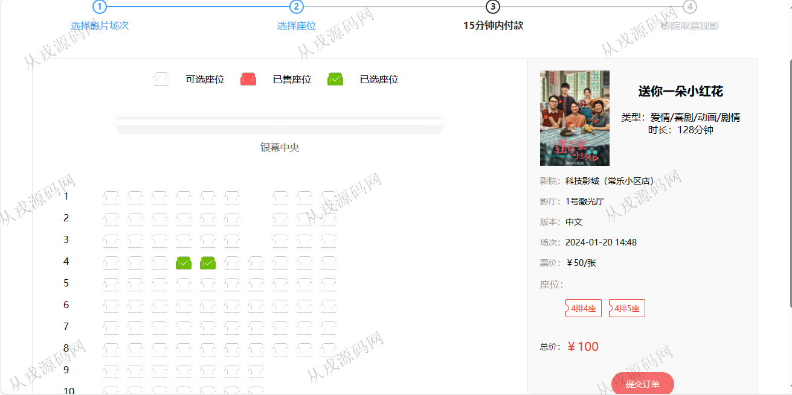
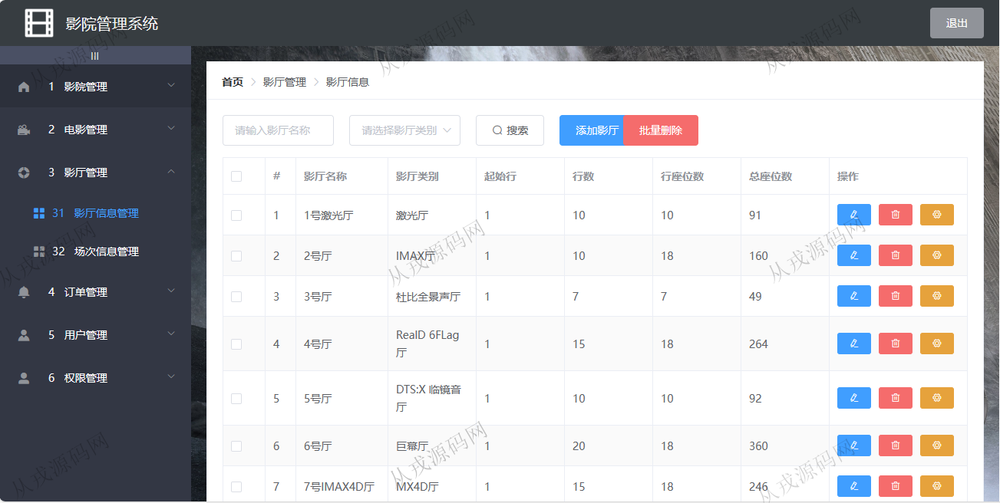
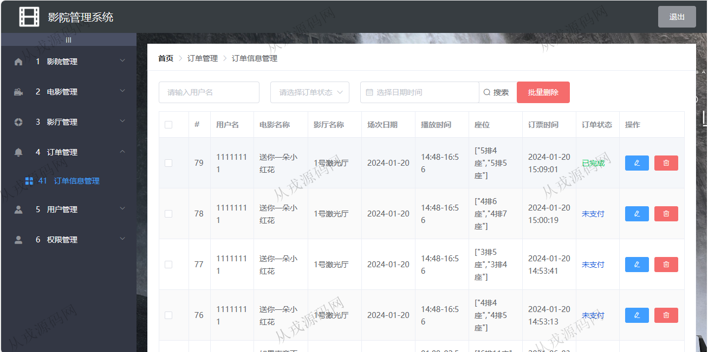

<h1 align="center">189.影院电影售票管理系统</h1>

 获取sql文件 QQ: 386869957 QQ群: 377586148 

 [更多源码项目: 从戎源码网](https://armycodes.com/) 

## 简介

> 本代码来源于网络,仅供学习参考使用!
>
> 提供1.远程部署/2.修改代码/3.设计文档指导/4.框架代码讲解等服务
>
> http://localhost:8888/login
>
> admin 123456
>
> http://localhost:8081/login
>
> 11111111 1111111
>

## 项目介绍
基于springboot+vue2的影院电影售票管理系统：前端 vue、elementui，后端 maven、springmvc、spring、mybatis；角色分为管理员、用户；集成电影在线选座、在线购票，在线提交订单等功能于一体的系统。

## 功能介绍

### 用户

- 基本功能：登录，注册，退出，个人信息查看与修改
- 网站首页：主导航栏，轮播图，正在热映，即将上映，经典影片，票房榜
- 购票：电影信息列表展示，电影详情，选座，提交订单，付款（模拟）
- 我的订单：订单列表查询，订单详情，订单删除

### 管理员

- 影院管理：影院信息的查看与修改
- 电影管理：电影信息的增删改查，图片上传，电影类型设置
- 电影类别管理：类别信息的增删改查
- 影厅信息管理：影厅信息的增删改查，座位安排
- 场次信息管理：场次信息的增删改查，查看座位，安排合适的场次，前台用户才可以在线购票
- 订单管理：用户下单，管理员后台查看订单数据，查看订单状态，订单修改与删除
- 用户管理：用户自行注册，管理员后台可以进行增删改查操作
- 权限管理：角色权限信息的增删改查，分配权限

## 环境

- <b>IntelliJ IDEA 2021.3</b>

- <b>Mysql 5.7.26</b>

- <b>Node 14.14.0</b>

- <b>JDK 1.8</b>

## 运行截图

